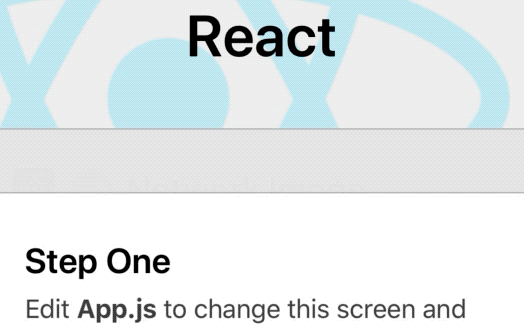

# react-native-rolling-bar

Rolling bar UI component for [React Native](https://github.com/facebook/react-native/).

## Demo



## Install

```sh
npm install react-native-rolling-bar
```

## Props

| Name              | type    | default value | description                                                                                                           |
|-------------------|---------|---------------|-----------------------------------------------------------------------------------------------------------------------|
| customStyle       | Object  | -             | custom styles for container                                                                                           |
| interval          | number  | 3000          | content change interval time in milliseconds                                                                          |
| animationDuration | number  | 600           | fade transition duration in milliseconds                                                                              |
| delayBetween      | number  | 100           | delay in milliseconds between fade-out and fade-in of next content (too short delay would cause incorrect transition) |
| defaultStyle      | boolean | false         | If false, removes default style. Set true If you want to use default style.                                           |
| forceRoll         | boolean | false         | If true, force rolling animation even if there is only one content.                                                   |

## Usage

1. As a rolling banner
```jsx
import RollingBar from 'react-native-rolling-bar';

// ...

  <RollingBar interval={3000} defaultStyle={true}>
    // You can fully customize this RollingBar component with customStyle prop.
    <ChildComponentOne />
    <ChildComponentTwo />
    <ChildComponentTree />
    ...
  </RollingBar>
```

2. As a transition content
```jsx
import RollingContent from 'react-native-rolling-bar';

// ...

  <YourBarComponent>
    // Without default style, you can also put the RollingBar inside your bar component.
    <RollingContent interval={3000} defaultStyle={false} customStyle={yourStyle}>
      <ChildOne />
      <ChildTwo />
      ...
    </RollingContent>
  </YourBarComponent>
```

## Acknowledge
Project template generated using [react-native-builder-bob](https://github.com/callstack/react-native-builder-bob) 👍

## License

MIT
